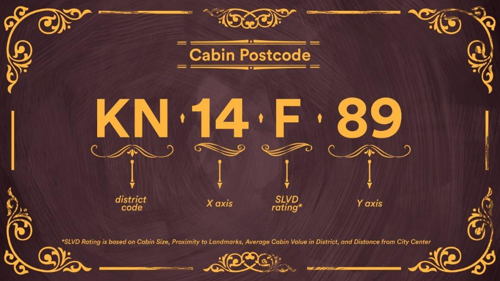
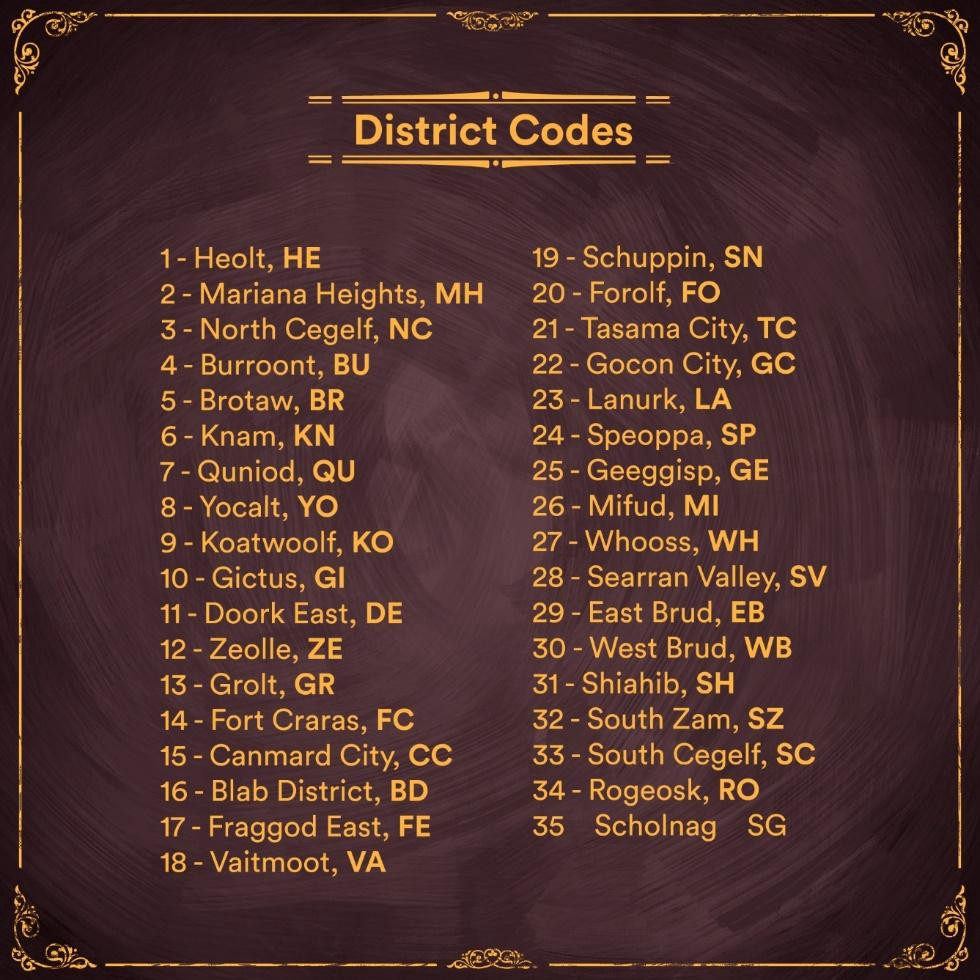

# Cabins, by The Ape Society

## Cabins

Cabins are high resolution customizable 3D rooms that come in three sizes - Chateaus are the largest size followed by Estates (medium) and Cottages (small). All cabins carry out the same function irrespective of size. The size only informs how big your interior cabin space will be. Cabins will run on a desktop app (PC & MAC) in Unreal Engine 4.&#x20;


Cabins preview in UE4&#x20;


## Cabins Utility

The main utility for cabins is in being able to build out your own personal web3 space. A space you can decorate to your liking, and add things that matter the most to you. You will also be able to invite friends to these spaces and carry out various activities together. At launch cabins will be used as a personal gallery where you can display your favourite NFTs to earn $SOCIETY, and decorate your space with items from The Ape Society Marketplace. However the possibility for cabins extends far beyond having a personal gallery.&#x20;

There are in total 10,000 cabins. 6000 of which are cottages, 3000 are estates and 1000 are Chateaus.

  

## SLVD, Districts and Postal Codes

As with apes, cabins also have unique identifiers. Every single cabin has a street address and a postal code. All street addresses and postal codes are unique. Contained within a postal code is all the information you could want from the cabin.

Each postal code contains a district code, which is the name of the district that the cabin belongs to, an X and Y axis and an SLVD rating.

There are 35 unique districts, each with their district codes. Certain districts have landmarks that might make them more attractive than other districts to cabin holders.

Learn more about Cabins & Addresses in the medium article below&#x20;


