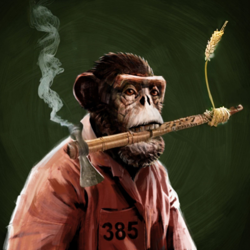

# Jarman\`s Escape

Jarman White toiled tirelessly in the city prison, where he found himself confined after being convicted of stealing coins from a drunken Monet ape. This particular ape had commissioned Jarman to craft a cushioned armchair, but when the work was completed, the unscrupulous Monet refused to pay, leading to Jarman's unfortunate fate. The Monet ape, wielding his influence, managed to sway the court, resulting in the imposition of the maximum sentence of 20 years on poor Jarman. To attempt to reduce his sentence, Jarman spent his days laboring in the prison's wheat fields, and his nights were dedicated to processing lumber to fuel the prison's cooking fires.

One fateful evening, while processing a bundle of bamboo, the hickory haft on Jarman's hatchet suddenly shattered. The tools provided to the prisoners were notoriously in poor condition. The rear of the hatchet head itself had even formed a concave shape and even formed a few structural cracks in the center, likely from years of prior prisoners using it to hammer nails during construction work. Jarman knew this incident wouldn't bode well with the prison warden. This particular warden, a Wright ape, had secretly been paid off by the same Monet ape responsible for Jarman's imprisonment, ensuring that Jarman wouldn't receive any reduction in his sentence. On fair weather days, the warden could be found leisurely relaxing near the wheat fields, smoking his pipe while closely watching Jarman for any errors he could exploit during the appeals process.&#x20;

As Jarman stared at the broken hatchet, anxiety gripped him. He was certain that his next attempt at a sentence reduction would fail due to this mishap. He had to think of a way to make this go unnoticed. After much pondering and panic, he grabbed a piece of bamboo and ingeniously used it as a makeshift handle for the hatchet, swiftly finishing his task and hastening back to the prison to deposit the load of lumber, aware that he was running late.&#x20;

However, the sharp-eyed warden noticed everything, especially when it came to Jarman. Nervously, Jarman attempted to quietly push his squeaky wheelbarrow to the back of the kitchen to deposit the firewood. "Late, I see?" the warden remarked with a smirk as he approached Jarman. "I apologize, ser," Jarman replied, "I had to take the long way around to avoid the wheelbarrow getting stuck in the mud." The gloomy weather had made the warden even more irritable, as he had been unable to enjoy his daily outdoor routine and smoke his pipe for a few days. This heightened irritability made the warden's attention to detail even keener. "Care to explain what happened to your hatchet, Jarman!?" he demanded. Jarman's heart sank. "Hand it over and come to my office. We need to document this damage immediately!" The warden collected the damaged hatchet as they both proceeded to the office.&#x20;

Inside the office, Jarman noticed a bag of coins with a note from a Monet ape on the side of the warden's desk. As the warden grudgingly searched his desk for a feather pen and ink, it was unclear whether he was more annoyed at not having his pipe or at having to write a damage report. This gave Jarman an idea. Every night, while bringing in firewood, he would pick some tobacco leaves and other mysterious herbs from the corner of the wheat field, which he shared with the other prisoners. Tonight, he still had some in his front pocket. "It's now or never," thought Jarman.&#x20;

"Sir, if I may, can I show you the upgrades I made to the hatchet?" said Jarman. "Upgrades? What do you mean upgrades, Jarman? It looks hideous and probably won't last a week chopping firewood!" muttered the warden. Nevertheless, Jarman confidently demonstrated, "By installing a bamboo haft with a hollow center, I converted the hatchet into a dual-purpose tool. It not only chops wood but also serves as a pipe for smoking. Would you like to try it?" The warden was flabbergasted. Was this some sort of trick? It had been a while since he tried a new pipe. "Hmm... why not," the warden conceded. Jarman pulled out the tobacco and mystery leaves from his front pocket, stuffed them into the concave rear of the hatchet head, lit the pipe, and handed it to the warden. "Here you go, ser. Give it a try."&#x20;

The warden suspiciously took a puff of the new pipe, then another, and a third. To Jarman's surprise, the warden looked pleasantly amazed! "Jarman, this is an amazing pipe; However, if you think this little gesture is going to let you off the hook that easily, you thought wrong." Jarman's brief moment of hope started to disintegrate. As the warden's contented puffs echoed through the office, Jarman sank into a brooding silence, his shoulders slumped with the weight of disappointment. Every effort he made to earn his freedom felt futile, leaving him immersed in a sea of despondency, wondering if fate had destined him to endure the full brunt of his sentence. The dreams of a life beyond prison walls seemed to dim with each passing moment, like stars fading into the blackness of the night. Then, amidst the depths of his despair, Jarman's ears caught the sound of snoring emanating from the warden's direction. The pipe, along with whatever mysterious leaves he had in his pocket, had put the warden to sleep!&#x20;

All the other guards were also asleep, as it was late at night. Jarman saw his opportunity. He grabbed the bag of coins from the side of the desk, took the warden's keys, and, clutching the makeshift bamboo-handled hatchet in his hand, he quietly snuck out of the office and the prison. With a heavy heart, he knew he would have to lie low for a while, but he needed a safe place to hide the coins. Determined to ensure no trace led back to him, he carefully dropped off the hatchet alongside the bag of coins, concealed within a pile of marble at the construction site where his family member, Beltran White, was involved in building the grand Amphitheatre. Once the items were safely stashed, Jarman made his escape, disappearing into the shadows of the night.

&#x20;

