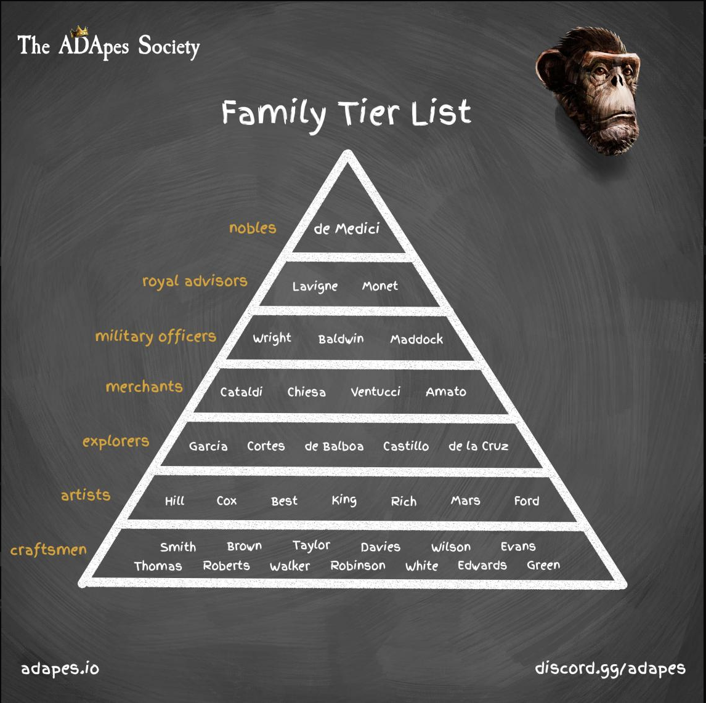
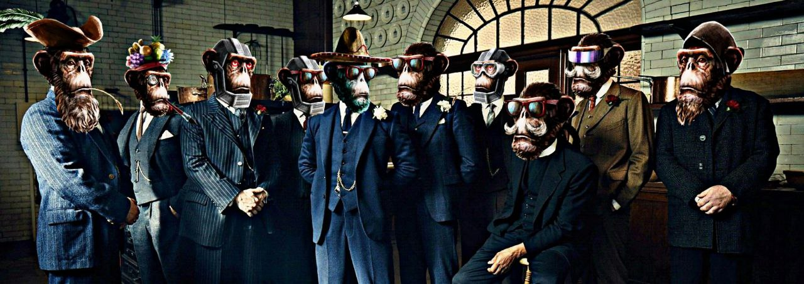

# Apes

## Ape Names

This is the very first project on cardano to have **named** NFTs. Each NFT has its own unique name in the form of a first name and a last name. This is because each ape belongs to one of 35 families.&#x20;

### Families

Each family represents a last name for an ape. There are a total of 35 families each belonging to a class. Your class informs how rare your last name is. For instance, at the very bottom of the pyramid are the craftsmen. The most essential class in the society, however they are also the most abundant. Last names belonging to this class are less rare than a last name belonging to a higher class, like the merchants. Each class has its own unique role to play in the economy of the society.&#x20;

## Class perks & Staking&#x20;

**Craftsmen**: They are the only class able to build assets that they can sell exclusively on the ape society marketplace. They have a base staking rate of 1.0x

**Artists**: They get higher chances of making white-lists, and also receive a free **frame**, an in-cabin asset used for staking. They have a staking rate of 1.15x

**Explorers**: They get 50% off all level 0 frames they purchase, and a 5% discount on every frame upgrade. This perk does not stack with multiple explorers. They have a staking rate of 1.35x

**Merchants**: They 2% of all the transaction volume to The Ape Society marketplace. They have a staking rate of 1.45x

**Military Officers**: They have a 10% of looting an item crafted by a craftsman. They also have a chance of looting special items from a chest, they are the only class that can obtain these items. They have a staking rate of 1.7x

**Royal Advisors**: They apply a 1.2x multiplier to the rate of all other apes they are staked with. They cannot apply this multiplier to themselves. They have a staking rate of 2.35x

**Nobles**: They receive a larger home upgrade, and have the highest staking rate of all classes. A whopping 7.0x

**Kings**: They are granted round table access (closest seats to Ape Force 1), and receive 2.5% of family rewards(not including frame rewards).&#x20;

## The Ape Society DAO

The Ape Society DAO is a DAO comprised of verified Ape Society holders. We collectively come together to write proposals on ideas and initiatives that will strengthen the brand. Some of these ideas proposed and passed include - The Ape society board game, donations to various charities, The Ape society pools initiative, a name rebranding, and many more. The DAO also gives you access to exclusive channels that include alpha channels, family channels, whitelist access, and committees formed to execute on proposals.&#x20;

The links below give you all the information you need about the process of proposals and voting





## Where to buy

[The Ape Society jpeg store](https://www.jpg.store/collection/theapesociety)
