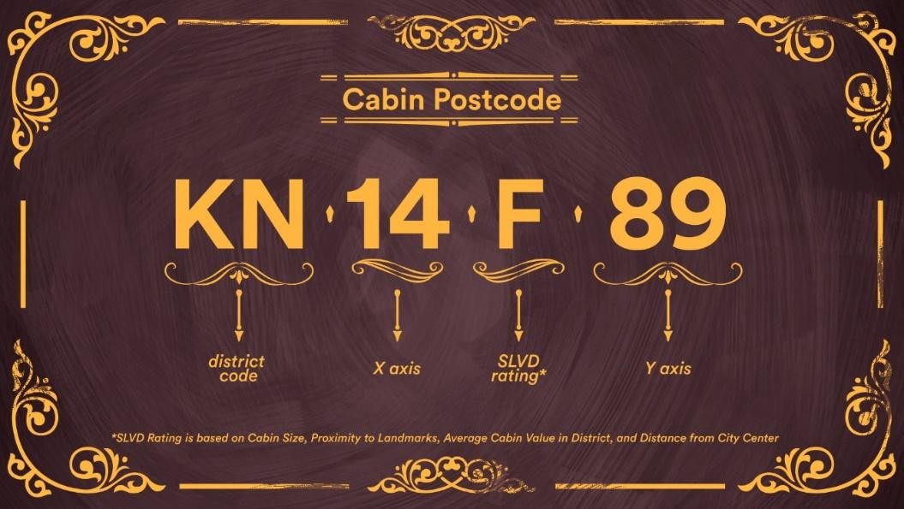
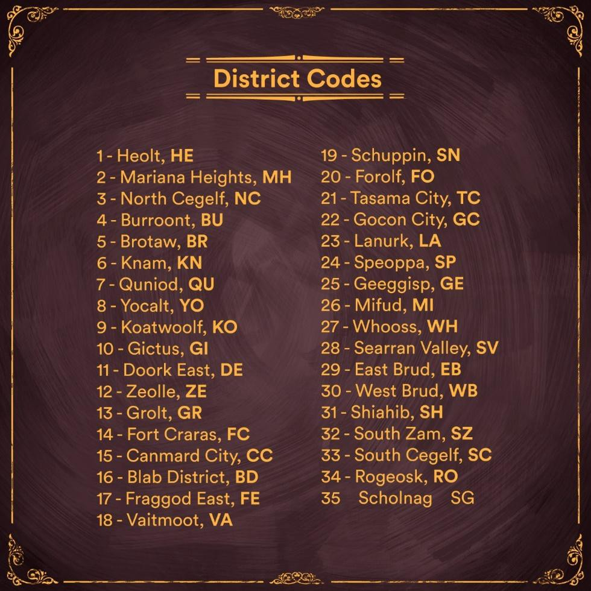

# Cabins, by The Ape Society

## Cabins

Cabins are high resolution customizable 3D rooms that come in three sizes - Chateaus are the largest size followed by Estates (medium) and Cottages (small). All cabins carry out the same function irrespective of size. The size only informs how big your interior cabin space will be. Cabins will run on a desktop app (PC & MAC) in Unreal Engine 4.&#x20;


Cabins preview in UE4&#x20;


## Cabins Utility

The main utility for cabins is in being able to build out your own personal web3 space. A space you can decorate to your liking, and add things that matter the most to you. You will also be able to invite friends to these spaces and carry out various activities together. At launch cabins will be used as a personal gallery where you can display your favourite NFTs to earn $SOCIETY, and decorate your space with items from The Ape Society Marketplace. However the possibility for cabins extends far beyond having a personal gallery.&#x20;

The team has spoken about plans to build various utility driven spaces such as auction houses, cigar lounges, games room, and more. There is also the possibility of integrating VR into the cabins spaces, as the Art Studio behind the ape society are award winners in the field of VR.&#x20;

There are in total 10,000 cabins. 6000 of which are cottages, 3000 are estates and 1000 are Chateaus.

  

## Cabin Assets

The assets below are just a few examples of hundreds of assets that will be available to purchase and furnish your cabin with. Some of these items could also be functional. For instance a gramophone might be able to play music, and a projector will be able to project pictures on a screen.

   

## Cabins heat-map

The Cabins heat-map is the first introduction of what one would call a 'metaverse map' for the ape society cabins. There will be a fully interactive map available on launch. For now, the heat-map gives cabin holders a rough idea of where their cabins lie on the map, and using a heat-map it tells cabins holders how 'rare' their cabin plots are. The closer plots are to the center, the more reddish they appear and thus the more rare they are. Cabins also receive an SLVD rating which correlates to how rare that cabin is. We will get into SLVD ratings in the next section

## SLVD, Districts and Postal Codes

As with apes, cabins also have unique identifiers. Every single cabin has a street address and a postal code. All street addresses and postal codes are unique. Contained within a postal code is all the information you could want from the cabin.

Each postal code contains a district code, which is the name of the district that the cabin belongs to, an X and Y axis and an SLVD rating

The SLVD rating ranges from A-Z. A being the rarest rating and Z being the least rare. The rating takes into account proximity to landmarks, size of cabin, closeness to the center of the map, and other factors that might not be known still. It is the best indicator of rarity for Cabins.&#x20;

There are 35 unique districts, each with their district codes. Certain districts have landmarks that might make them more attractive than other districts to cabin holders. However nothing has been announced with regards to the purpose of landmarks so be wary.&#x20;

Learn more about Cabins & Addresses in the medium article below&#x20;



## Where to buy

[Cabins by The Ape Society](https://www.jpg.store/collection/cabins-theapesociety)
