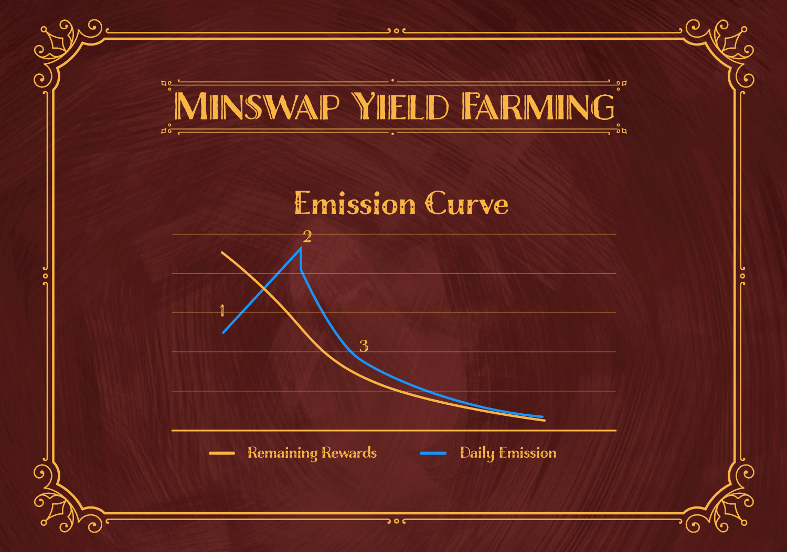

# $SOCIETY

## $SOCIETY

SOCIETY is the unit of account for The Ape Society. Apes will use society to conduct business, host contests, fund proposals, buy and sell assets, merch and other things still under wraps.

## Utility

$SOCIETY is poised to become one of the highest utility token on the cardano blockchain. The following are the **currently** disclosed utility for the society token. The team behind The Ape Society has stressed that there is more utility planned for $SOCIETY


[frames.md](frames.md)



[society-marketplace.md](society-marketplace.md)



[merchandise.md](merchandise.md)


## Distribution

| Recipient              | Society amount | % Society |
| ---------------------- | -------------- | --------- |
| Founders               | 21 million     | 3%        |
| Airdrop                | 35 million     | 5%        |
| TAS DAO fund           | 49 million     | 7%        |
| Community Initiatives  | 21 million     | 3%        |
| TASPI (DAO Initiative) | 21 million     | 3%        |
| Staking Rewards        | 462 million    | 66%       |
| Undisclosed            | 91 million     | 13%       |

## Emission Schedule

The emissions schedule is a schedule tailor fit for staking. Apes that are staked will emit society according to the curve below. The emissions will start at point 1, it will rise until it peaks at point 2, before it sharply declines until point 3, and then will steadily go down until it hits a steady state value for the rest of time.&#x20;

The timeline for the curve is unknown to prevent participants from gaming the system

## Earning $SOCIETY

There are currently 3 ways to earn society

* Staking apes: Staking your apes on The Ape Society staking platform is the best way to earn society. See [Staking](../apes/#class-perks-and-staking)&#x20;
* Minswap double farm: You can earn society by staking your society on minswap and earning society from the double farm. [Minswap farm ](https://app.minswap.org/farm)
* TASPI pools: You can stake your ADA with a TASPI pool in order to earn society. Rewards are dished out every epoch. Eligibles pools are Cardanistas, Allincrypto, Quixote, Alam0, ACME, TSC, NERD

## Where to buy

You can currently purchase society on [Minswap](https://app.minswap.org/swap)
